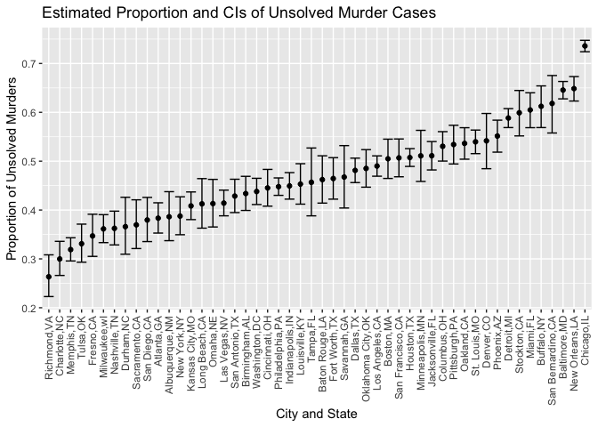

p8105_hw5_mf3532
================
Meng Fang
2022-11-03

## Problem 2

#### Load Data

``` r
homicide <-  read_csv("./homicide-data.csv")
```

    ## Rows: 52179 Columns: 12
    ## ── Column specification ────────────────────────────────────────────────────────
    ## Delimiter: ","
    ## chr (9): uid, victim_last, victim_first, victim_race, victim_age, victim_sex...
    ## dbl (3): reported_date, lat, lon
    ## 
    ## ℹ Use `spec()` to retrieve the full column specification for this data.
    ## ℹ Specify the column types or set `show_col_types = FALSE` to quiet this message.

``` r
head(homicide)
```

    ## # A tibble: 6 × 12
    ##   uid    repor…¹ victi…² victi…³ victi…⁴ victi…⁵ victi…⁶ city  state   lat   lon
    ##   <chr>    <dbl> <chr>   <chr>   <chr>   <chr>   <chr>   <chr> <chr> <dbl> <dbl>
    ## 1 Alb-0…  2.01e7 GARCIA  JUAN    Hispan… 78      Male    Albu… NM     35.1 -107.
    ## 2 Alb-0…  2.01e7 MONTOYA CAMERON Hispan… 17      Male    Albu… NM     35.1 -107.
    ## 3 Alb-0…  2.01e7 SATTER… VIVIANA White   15      Female  Albu… NM     35.1 -107.
    ## 4 Alb-0…  2.01e7 MENDIO… CARLOS  Hispan… 32      Male    Albu… NM     35.1 -107.
    ## 5 Alb-0…  2.01e7 MULA    VIVIAN  White   72      Female  Albu… NM     35.1 -107.
    ## 6 Alb-0…  2.01e7 BOOK    GERALD… White   91      Female  Albu… NM     35.2 -107.
    ## # … with 1 more variable: disposition <chr>, and abbreviated variable names
    ## #   ¹​reported_date, ²​victim_last, ³​victim_first, ⁴​victim_race, ⁵​victim_age,
    ## #   ⁶​victim_sex

#### Create a city_state variable (e.g. “Baltimore, MD”) and then summarize within cities to obtain the total number of homicides and the number of unsolved homicides (those for which the disposition is “Closed without arrest” or “Open/No arrest”).

``` r
homicide <- homicide %>%
  mutate(city_state = str_c(city,",",state),
         status = case_when(
           disposition == "Closed without arrest" ~ "unsolved",
           disposition == "Open/No arrest" ~ "unsolved",
           disposition == "Closed by arrest" ~ "solved")) %>% 
  group_by(city_state, status) %>% 
  summarise(count = n()) %>%
  pivot_wider(names_from = status, values_from = count) %>% mutate(total = solved + unsolved) %>% 
  filter(city_state != "Tulsa,AL") %>%
  select(-solved)
```

    ## `summarise()` has grouped output by 'city_state'. You can override using the
    ## `.groups` argument.

``` r
knitr::kable(homicide)
```

| city_state        | unsolved | total |
|:------------------|---------:|------:|
| Albuquerque,NM    |      146 |   378 |
| Atlanta,GA        |      373 |   973 |
| Baltimore,MD      |     1825 |  2827 |
| Baton Rouge,LA    |      196 |   424 |
| Birmingham,AL     |      347 |   800 |
| Boston,MA         |      310 |   614 |
| Buffalo,NY        |      319 |   521 |
| Charlotte,NC      |      206 |   687 |
| Chicago,IL        |     4073 |  5535 |
| Cincinnati,OH     |      309 |   694 |
| Columbus,OH       |      575 |  1084 |
| Dallas,TX         |      754 |  1567 |
| Denver,CO         |      169 |   312 |
| Detroit,MI        |     1482 |  2519 |
| Durham,NC         |      101 |   276 |
| Fort Worth,TX     |      255 |   549 |
| Fresno,CA         |      169 |   487 |
| Houston,TX        |     1493 |  2942 |
| Indianapolis,IN   |      594 |  1322 |
| Jacksonville,FL   |      597 |  1168 |
| Kansas City,MO    |      486 |  1190 |
| Las Vegas,NV      |      572 |  1381 |
| Long Beach,CA     |      156 |   378 |
| Los Angeles,CA    |     1106 |  2257 |
| Louisville,KY     |      261 |   576 |
| Memphis,TN        |      483 |  1514 |
| Miami,FL          |      450 |   744 |
| Milwaukee,wI      |      403 |  1115 |
| Minneapolis,MN    |      187 |   366 |
| Nashville,TN      |      278 |   767 |
| New Orleans,LA    |      930 |  1434 |
| New York,NY       |      243 |   627 |
| Oakland,CA        |      508 |   947 |
| Oklahoma City,OK  |      326 |   672 |
| Omaha,NE          |      169 |   409 |
| Philadelphia,PA   |     1360 |  3037 |
| Phoenix,AZ        |      504 |   914 |
| Pittsburgh,PA     |      337 |   631 |
| Richmond,VA       |      113 |   429 |
| Sacramento,CA     |      139 |   376 |
| San Antonio,TX    |      357 |   833 |
| San Bernardino,CA |      170 |   275 |
| San Diego,CA      |      175 |   461 |
| San Francisco,CA  |      336 |   663 |
| Savannah,GA       |      115 |   246 |
| St. Louis,MO      |      905 |  1677 |
| Stockton,CA       |      266 |   444 |
| Tampa,FL          |       95 |   208 |
| Tulsa,OK          |      193 |   583 |
| Washington,DC     |      589 |  1345 |

#### For the city of Baltimore, MD, use the prop.test function to estimate the proportion of homicides that are unsolved; save the output of prop.test as an R object, apply the broom::tidy to this object and pull the estimated proportion and confidence intervals from the resulting tidy dataframe.

``` r
baltimore_df <- homicide %>% filter(city_state == "Baltimore,MD")
```

plug in corresponding variables to `prop.test` function.

``` r
prop.test(baltimore_df%>%pull(unsolved), baltimore_df%>%pull(total)) %>%
  tidy() %>% 
  select(estimate, conf.low, conf.high)
```

    ## # A tibble: 1 × 3
    ##   estimate conf.low conf.high
    ##      <dbl>    <dbl>     <dbl>
    ## 1    0.646    0.628     0.663

#### Now run prop.test for each of the cities in your dataset, and extract both the proportion of unsolved homicides and the confidence interval for each. Do this within a “tidy” pipeline, making use of purrr::map, purrr::map2, list columns and unnest as necessary to create a tidy dataframe with estimated proportions and CIs for each city.

-   first create a function to get estimate, and bounds for CIs.

``` r
prop_ci <- function(x, n){
  prop.test(x,n) %>% tidy() %>% select(estimate, conf.low, conf.high)
}
```

-   Get the result dataframe

``` r
result_df <- homicide %>%
  mutate(prop_tests = map2(.x = unsolved, .y = total, ~prop_ci(x = .x, n = .y))) %>%
  unnest() %>%
  select(estimate, conf.low, conf.high)
```

    ## Warning: `cols` is now required when using unnest().
    ## Please use `cols = c(prop_tests)`

    ## Adding missing grouping variables: `city_state`

``` r
result_df
```

    ## # A tibble: 50 × 4
    ## # Groups:   city_state [50]
    ##    city_state     estimate conf.low conf.high
    ##    <chr>             <dbl>    <dbl>     <dbl>
    ##  1 Albuquerque,NM    0.386    0.337     0.438
    ##  2 Atlanta,GA        0.383    0.353     0.415
    ##  3 Baltimore,MD      0.646    0.628     0.663
    ##  4 Baton Rouge,LA    0.462    0.414     0.511
    ##  5 Birmingham,AL     0.434    0.399     0.469
    ##  6 Boston,MA         0.505    0.465     0.545
    ##  7 Buffalo,NY        0.612    0.569     0.654
    ##  8 Charlotte,NC      0.300    0.266     0.336
    ##  9 Chicago,IL        0.736    0.724     0.747
    ## 10 Cincinnati,OH     0.445    0.408     0.483
    ## # … with 40 more rows

#### Create a plot that shows the estimates and CIs for each city – check out geom_errorbar for a way to add error bars based on the upper and lower limits. Organize cities according to the proportion of unsolved homicides.

``` r
result_df %>%
  ggplot(aes(x = reorder(city_state, estimate), y = estimate)) +
  geom_point() +
  geom_errorbar(aes(ymin = conf.low, ymax = conf.high)) +
  theme(axis.text.x = element_text(angle = 90, vjust = 0.5, hjust = 1)) +
  xlab("City and State") +
  ylab("Proportion of Unsolved Murders") +
  ggtitle("Estimated Proportion and CIs of Unsolved Murder Cases ")
```

<!-- -->

## Problem 3

#### Generate 5000 datasets from the model
